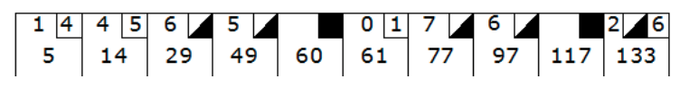

# Kata : Jeu de bowling 
Niveau : 2/3



## Ennoncé
Règles du jeu :
Le jeu consiste en 10 tours comme indiqué.  
A chaque tour le joueur a deux occasions de faire tomber les 10 quilles.  
Le score d’un tour est le total du nombre de quilles tombées, plus un bonus pour les strikes et les spare.  

Un spare est quand le joueur tombe les 10 quilles en 2 coups.  
Le bonus pour ce tour est le total des quilles tombées dans le prochain tir.  

Un strike est quand le joueur tombe les 10 quilles au premier coup.  
Le bonus pour ce tour est le total des quilles tombées dans les deux prochains tir.  
Au besoin sur le dernier tour, deux tirs de plus sont fait pour calculer le score. 

Dans un match parfait (que des strike) le score est de 300 points.  

## Exercice
Créer la classe suivante : 
```
class Bowling
    // Permet de renseigner sur le score d’un tir 
    public void roll(int pins)
    // Permet de récupérer le score en cours 
    public int score()
```
